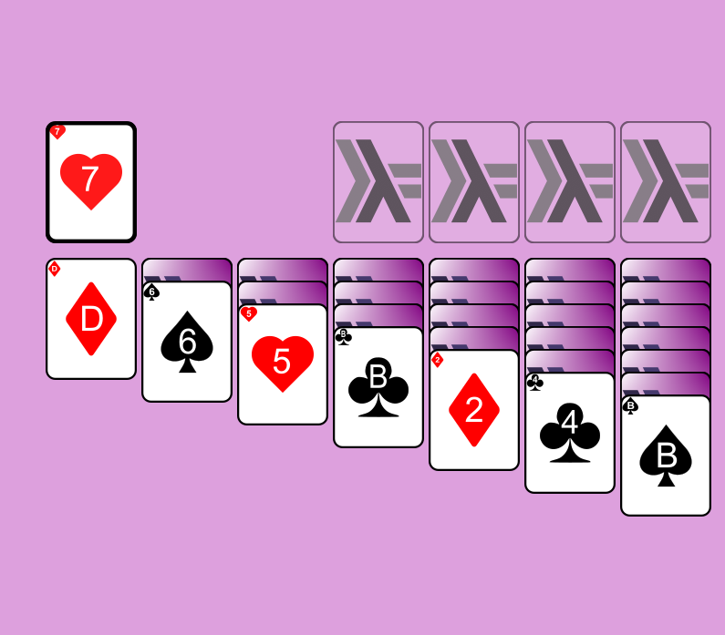

# patience-game-haskell

A Patience Solitaire game implemented in Haskell. Play the classic card game with a functional programming touch.

## Gameplay

Use the arrow keys and SPACE to select a card. Use ENTER to rotate the stack. 



## Running the Program

Before you can run the program, ensure that you have Haskell and Stack installed on your system. You can find instructions for installing Haskell and Stack on the [official Haskell website](https://www.haskell.org/).

### Step 1: Clone the Repository
Clone the repository to your local machine using the following command:
```sh
git clone https://github.com/lbarraga/patience-game-haskell
```

### Step 2: Navigate to the Repository
Change to the repository directory:
```sh
cd patience-game-haskell
```

### Step 3: Run the Program
Run the program using Stack:
```sh
stack run
```

You should now see the program running and can interact with it as per the program's instructions.

Feel free to explore the repository and modify the program as you wish. Contributions are welcome!
